# 🌤️ Weather App

A modern and responsive weather dashboard built with **HTML, CSS, and Vanilla JavaScript**.

This project provides real-time weather information with a clean user interface, dynamic weather-based themes, city search, location support, hourly temperature charts, and a 7-day forecast.

The application is available as both a responsive web application and a native Android application built with **Capacitor**.

The goal of this project was to practice modern frontend development concepts including API integration, asynchronous JavaScript, responsive design, mobile app packaging, and dynamic UI development.

---

# 🚀 Live Demo

Try the web application online:

https://saeed-motevalli.github.io/weather-app/


# 📦 Repository

View the source code:

https://github.com/Saeed-Motevalli/weather-app


# 📱 Android APK

Download the Android application:

[Download Android APK](https://github.com/Saeed-Motevalli/weather-app/releases/tag/v1.0.0)

---

# 📸 Screenshots

> The screenshots below show selected examples of the application interface.  
> The application dynamically changes its visual theme based on real weather conditions.

## Desktop View

### Sunny Weather

<p align="center">
  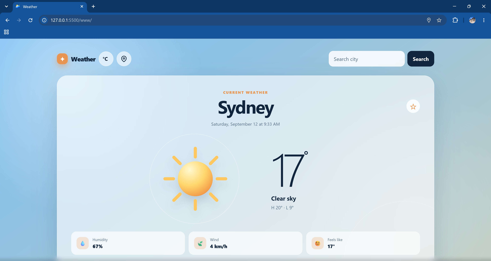
</p>


### Rainy Weather

<p align="center">
  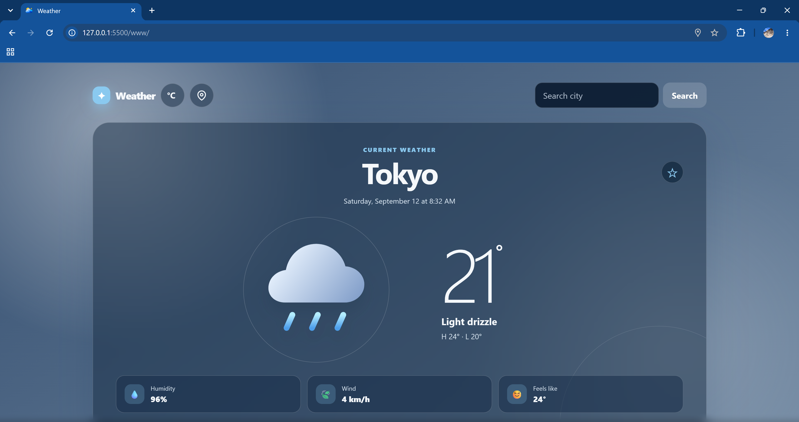
</p>


### Cloudy Night Weather

<p align="center">
  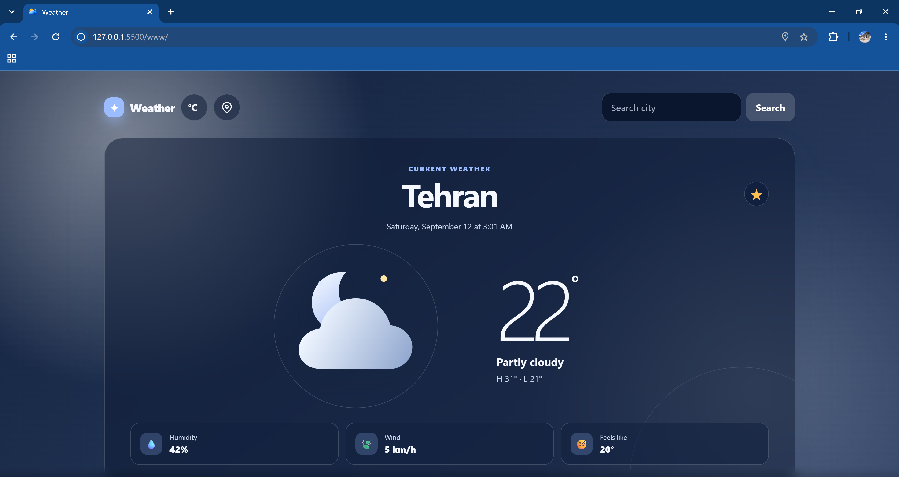
</p>


### City Search

<p align="center">
  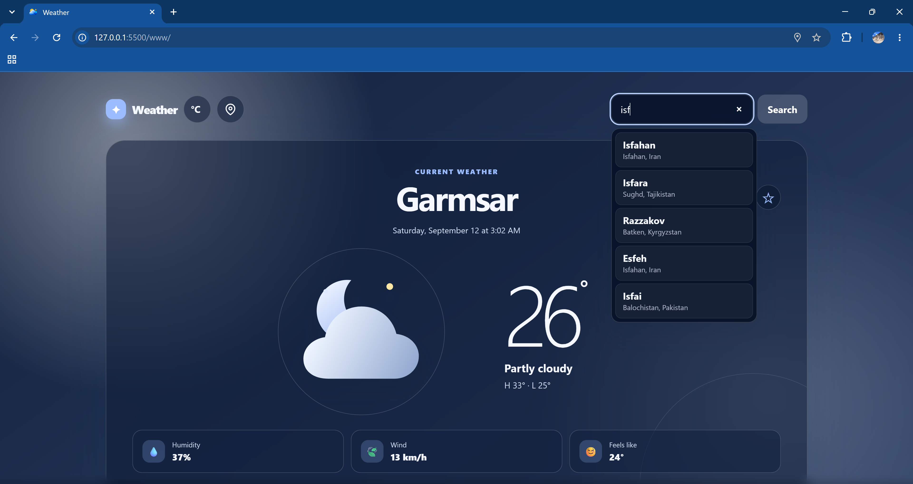
</p>


### Favorite Cities

<p align="center">
  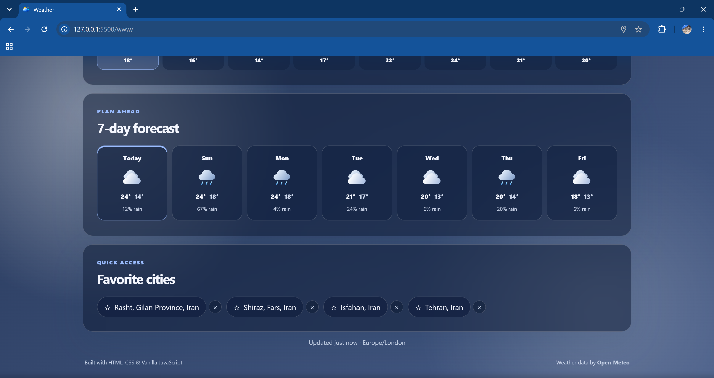
</p>


---

# 📱 Mobile View

## Weather Theme Examples

<p align="center">
  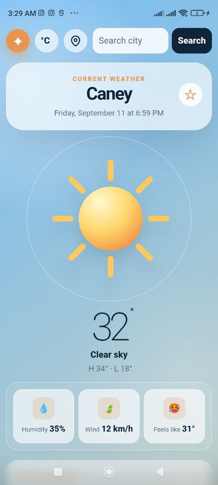
  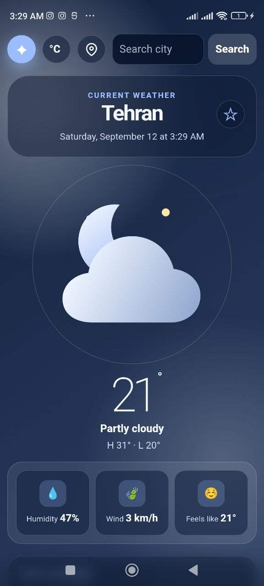
  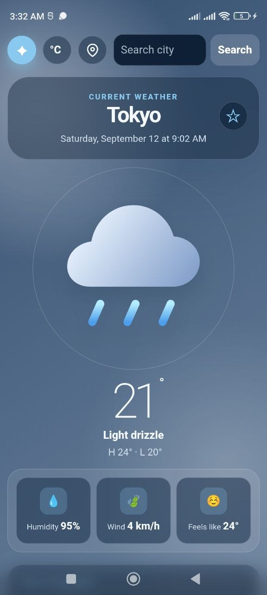
</p>


## Hourly Temperature

<p align="center">
  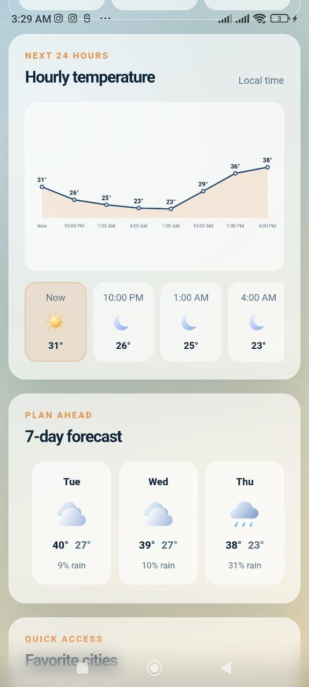
  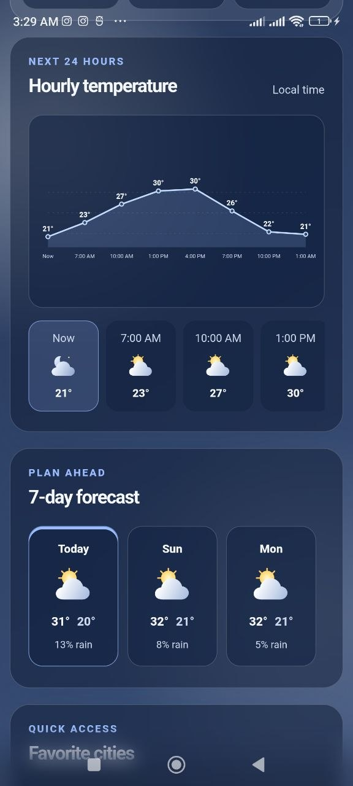
  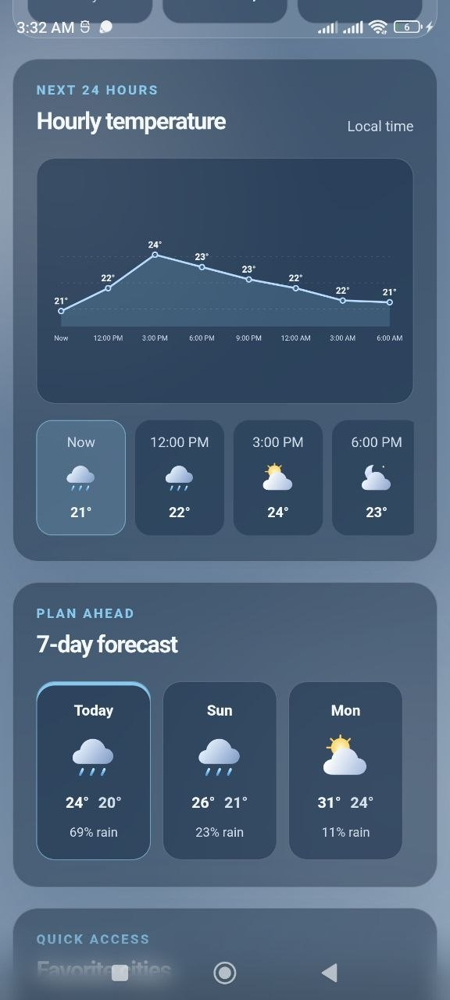
</p>


## Search Mobile

<p align="center">
  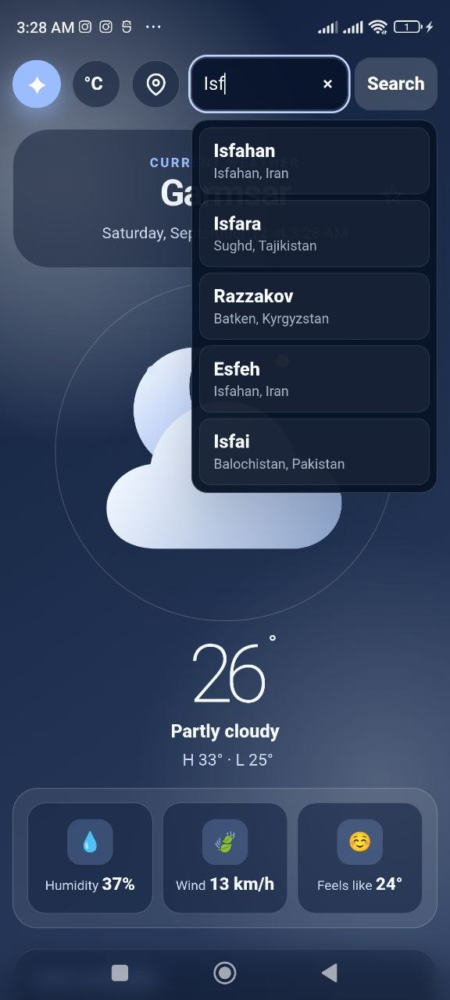
</p>


## Favorite Cities Mobile

<p align="center">
  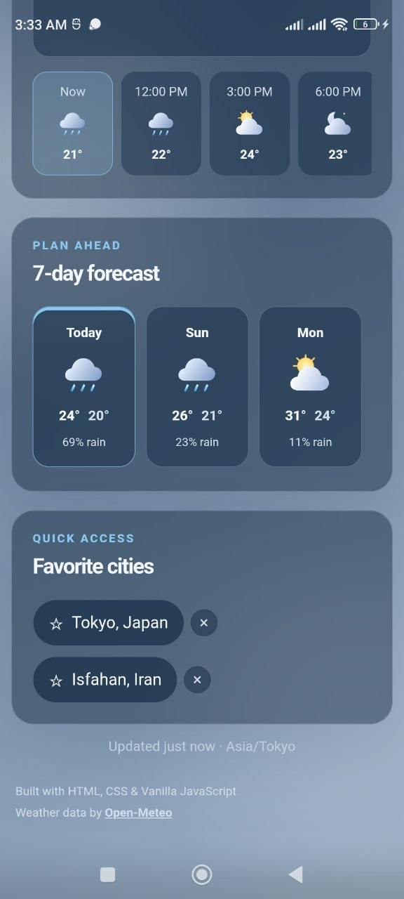
</p>


---

# ✨ Features

## 🌡️ Weather Information

- Real-time weather data
- Current temperature
- Weather condition
- Humidity
- Wind speed
- Feels like temperature
- Hourly temperature forecast
- 7-day weather forecast


## 🔎 Search & Location

- Search cities worldwide
- City suggestions while typing
- Current location support
- Automatic weather detection
- Reverse geocoding support


## 🎨 Dynamic Weather Experience

The interface automatically changes based on weather conditions.

Supported weather themes:

- Clear sky
- Partly cloudy
- Cloudy
- Rain
- Heavy rain
- Snow
- Thunderstorm
- Fog / Mist


Additional user experience features:

- Loading screen
- Toast notifications
- Smooth animations and transitions
- Responsive layouts


## ⭐ Personalization

- Celsius/Fahrenheit conversion
- Favorite cities
- Persistent user settings using LocalStorage


---

# 📱 Android Application

The Android version of this project is built using **Capacitor**.

The application runs as a native Android app while sharing the same frontend codebase.

Features include:

- Native Android packaging
- Mobile optimized interface
- Same weather experience as the web version
- APK release distribution through GitHub Releases


---

# 🛠 Technologies Used

- HTML5
- CSS3
- JavaScript (ES6+)
- Fetch API
- Open-Meteo API
- OpenStreetMap Nominatim API
- Geolocation API
- LocalStorage
- SVG
- Responsive Web Design
- Capacitor
- Android Studio


---

# 📌 Technical Highlights

- Asynchronous API communication
- DOM manipulation and dynamic rendering
- Client-side application state management
- Weather data processing
- SVG-based temperature chart generation
- Geolocation integration
- Reverse geocoding implementation
- LocalStorage data persistence
- Dynamic UI updates based on weather conditions
- Responsive CSS architecture
- Web application converted into Android application using Capacitor


---

# 📂 Project Structure

```text
Weather-App/

├── README.md
│
├── www/
│   ├── index.html
│   ├── style.css
│   ├── script.js
│   │
│   ├── assets/
│   │   └── skycast-logo.png
│   │
│   └── weather-icons/
│
├── screenshots/
│
├── android/
│
├── capacitor.config.json
│
├── package.json
│
└── package-lock.json

```

---

# 🔮 Future Improvements

Possible improvements:

- Progressive Web App (PWA) support
- Weather alerts
- Interactive weather maps
- User accounts
- Cloud synchronization
- Multi-language support

---

# 👨‍💻 Author

**Saeed Motevalli**

Frontend Developer

GitHub: [Saeed-Motevalli](https://github.com/Saeed-Motevalli)
